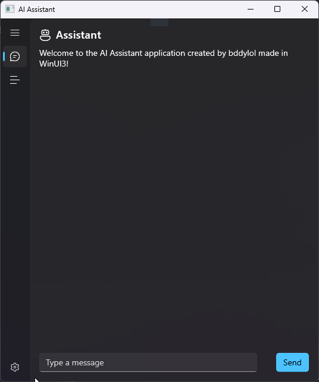

# AI-Assistant

---

---

## Overview

This is an AI assistant built using WinUI 3, C#, and XAML. This app lets you have a friendly conversation with an AI. You can ask it questions, tell it to do things, and more. It is also open source, so you can contribute to it if you want to.

## Features

- Friendly conversation
- Open source
- Easy to use
- User friendly
- And more!

## Installation

To install this app, you can either download the source code and build it yourself, or you can download the already built release from the releases page.

## Contributing

To contribute to this project, you can either open an issue or create a pull request. If you want to create a pull request, please make sure that you have tested your code before submitting it.

1. Fork the repository
2. Create a new branch for your feature or bug fix
3. Make your changes and ensure that they work
4. Commit your changes, preferably with [conventional commits](https://www.conventionalcommits.org/en/v1.0.0/)
5. Create a pull reqeust to the `main` branch of this repository

## License

This project is licensed under the [MIT License](https://github.com/buddy-codes/AI-Assistant/blob/master/LICENSE.txt)
